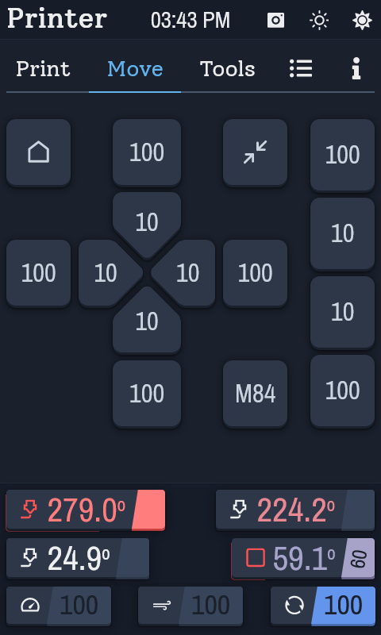
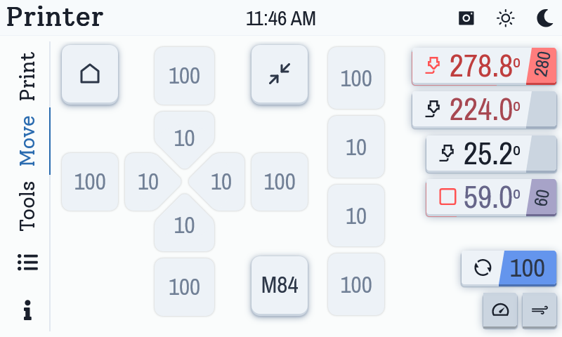
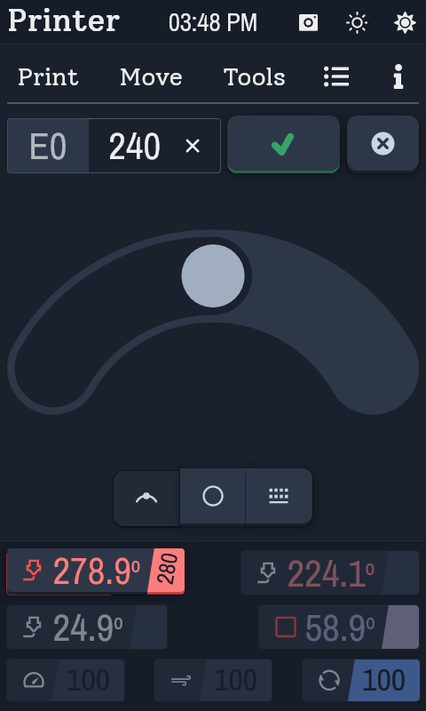
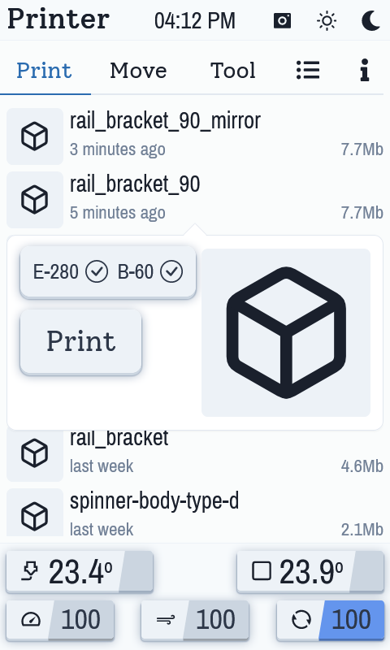
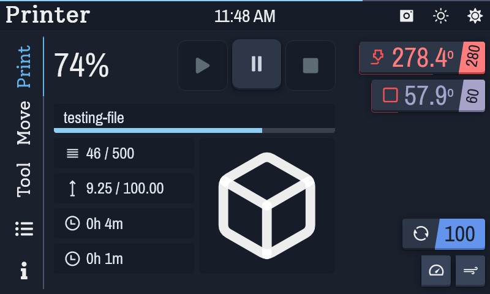
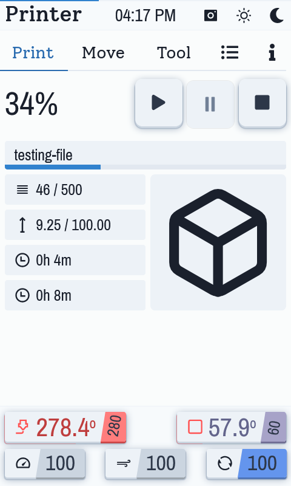

# Helm

A touch user interface for [Klipper](https://github.com/Klipper3d/klipper) based 3d printers.

## WIP
This is a work in progress and not ready for production use. However if you like tinker with your printers I would for you to try it out :)

## Install
Helm is a web app intended to run on a raspberry pi running [Klipper](https://github.com/Klipper3d/klipper) firmware, and requires the [Moonraker](https://github.com/Arksine/moonraker) api layer be installed.
A setup using [Mainsail](https://github.com/mainsail-crew/mainsail) or [Fluidd](https://github.com/fluidd-core/fluidd) should have the requisite dependencies already installed.

### Serving
The apps static files are served with nginx.

-   copy the release files to **/home/pi/helm**
-   copy **srv/helm** to **/etc/nginx/sites-available**: `sudo cp ~/helm/srv/helm /etc/nginx/sites-available/helm`
-   simlink to sites-enabled: `sudo ln -s /etc/nginx/sites-available/helm /etc/nginx/sites-enabled/`
-   if fluidd or mainsail is not already installed it may be necessary to copy **~helm/srv/upstreams.conf** and **~helm/srv/common_vars.conf** to **/etc/nginx/conf.d**

### Display
Set appropriate options for your display in boot/config.txt.
Below is an example for using a HDMI display on a raspberry pi4.

```
dtoverlay=vc4-fkms-v3d
hdmi_group=2
hdmi_mode=87
hdmi_cvt 800 480 60 6 0 0 0 0
```

Configure the touchscreen for proper input, an example libinput file for an 800x480 touchscreen is in the srv directory and can be copied to /etc/X11/xorg.conf.d

### Kiosk
The app is run in chromium in kiosk mode, this provides a dedicated fullscreen experience.

Install the **X window system**, **chromium-browser** and a **service** to run the app in chromium at startup.

#### X window system
-   install xserver: `sudo apt-get install --no-install-recommends xserver-xorg xserver-xorg-legacy xinit x11-xserver-utils dpkg-reconfigure`

#### Chromium
-   install chromium-browser and kiosk dependencies: `sudo apt-get install chromium-browser matchbox-window-manager xautomation unclutter`

If chromium quits instantly it may have locked the profile, this can be fixed by running: `rm -rf ~/.config/chromium/Singleton*`

#### Service
-   set permissions on service files: `sudo chmod 755 ~/helm/srv/helm.sh` and: `sudo chmod 644 ~/helm/srv/helm.service`
-   enable helm service: `sudo systemctl enable ~/helm/srv/helm.service`
-   allow service to start xserver by selecting 'anybody' when running: `sudo dpkg-reconfigure xserver-xorg-legacy`

#### Done
Time to restart the pi and glory in the new: `sudo reboot`

## Screenshots

### Main screen




### Adjusting temperature


### File select


### Printing




## Storybook
Storybook is used in this project to allow development of components in isolation and to avoid the need for a connection to a working printer.

It is also a good way to get a feel for the interface.

To run the storybook:
-   Clone the repo
-   install dependencies with `yarn`
-   then start storybook with `yarn storybook`

## License
Copyright (c) Laurence Gush

This repo is under the GNU Affero General Public License v3.0.<br>
See [LICENSE](https://github.com/LaurenceGGush/Helm/blob/main/LICENSE) File.